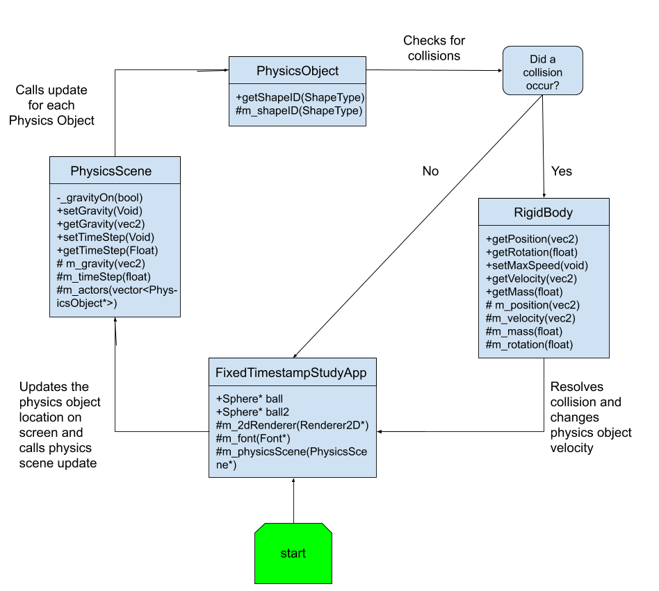

| Lodis Perkins|
| :---          	|
| s188043     	|
| Physics For Games |
| Custom Physics Simulation Documentation |

## I. Requirements

1. Description of Problem

	- **Name**: Custom Physics Simulation

	- **Problem Statement**: 
	Implementation and demonstration of custom physics systems implemented within a real time application

	- **Problem Specifications**: 
     Implementation of static and dynamic rigid body physics that interact
together.Forces applied to physics bodies.Visualisation of physics bodies. Physics simulations run as expected without physical errors.

2. Input Information
- A- moves red ball left
- D - moves red ball right
- W - moves red ball up
- S - moves red ball down
- Space - toggles gravity on/off

3.  Output Information 
- The program shows two balls colliding in a realistic way
- 
   
4. User Interface Information
	-The program displays text to show the user what inputs to use to interact with it.

## II. Design

1. _System Architecture_

| 
|:-----------
Class Flow diagram
| 
| 
1. _User Interface_

The program displays what the controls are and the position of the balls.

1. ### Object Information

   **File**: FixedTimestampStudyApp

     Description: Class responsible for main game loop.
     
    **Attributes**

         Name: ball
             Description: The red ball.
             Type: Sphere*

        Name: ball2
             Description: The green ball.
             Type: Sphere*

        Name: m_physicsScene
             Description: The scene that updates the balls velocity and position.
             Type: PhysicsScene*

    **File**: PhysicsObject.h

     Description: An object to be updates by theb physics scene.
    **Operations**

         Name: debug()
             Description: Overwritten b y inherited classes to debug in a way that is useful for them.
             Type: virtual void 

        Name: makeGizmo()
             Description: Creates sone sort of shape defined by the inherited class.
             Type: virtual void

        Name: resetPosition()
             Description: Resets the position of the physics object ot be whatever is specified in the function body.
             Type: virtual void
        Name: getShapeID()
             Description: Returns the current value of the m_shapeID.
             Type: ShapeType
     **Attributes**:

        Name: m_ShapeID
             Description: The enum that represnts the type of shape ths object is
             Visibility: ShapeType
    **File**: PhysicsScene.h

     Description: The scene class for the application. Used to update actorsand run simulation.
    **Attributes**

         Name: m_actors
             Description: A list of all actors in scene.
             Type: vector<PhysicsObject*>

        Name: m_gravity
             Description: The force of gravity.
             Type: vec2
        Name: _gravityOn
             Description: Keeps track of whether gravity is on or off.
             Type: bool   
     **Operations**:

        Name: addActor(PhysicsObject* actor)
             Description: Adds actor to actor list so it can update.
             Visibility: Public
          Name: removeActor(PhysicsObject* actor)
             Description: Removes actor from actor list.
             Visibility: Public
          Name: update()
             Description: Update loop for physics scene called every frame.
             Visibility: Public
          Name: updateGizmos()
             Description: Updates the position of gizmos drawn on screen.
             Visibility: Public
          Name: checkForCollision()
             Description: Checks the collision for all actors in scene.
             Visibility: Public
          Name: setGravity(const glm::vec2 gravity)
             Description: Sets the effect of gravity in whatever direction is given.
             Visibility: Public
          Name: getGravity()
             Description: Returns what the force of gravity as a vector.
             Visibility: Public
          Name: toggleGravity()
             Description: Turns gravity on/off when called.
             Visibility: Public
          Name: setTimeStep(const float timeStep)
             Description: Sets the timestep for this physics scene to use.
             Visibility: Public
          Name: getTimeStep()
             Description: Returns this physics scenes timestep.
             Visibility: Public
          Name: debugScene()
             Description: Calls debug for each actor and prints how many actors are in scene.
             Visibility: Public
          Name: sphere2Sphere(PhysicsObject*, PhysicsObject*)
             Description: Checks to see if two spheres have collided.
             Visibility: Public
    **File**: RigidBody.h

     Description: Used to give rigidbodies to ohysics objects making reaslistic collision resolution possible.
    **Attributes**

         Name: m_rotation
             Description: The current rotation of the object in degrees.
             Type: float
          Name: m_mass
             Description: The mass of the object.
             Type: float
          Name: m_velocity
             Description: The current velocity of the object.
             Type: vec2
          Name: m_position
             Description: The current position of the object.
             Type: vec2
     **Operations**:

        Name: applyForce(glm::vec2 force)
             Description: Applies a force with the magnitude and direction given.
             Visibility: Public
          Name: ApplyForceToActor(RigidBody* actor2, glm::vec2 force)
             Description: Applies a force using an actor to apply an equal an opposite force to both actors.
             Visibility: Public
          Name: resolveCollision(RigidBody * actor2)
             Description: Applies the force and direction to the actors based on velocity and elasticity.
             Visibility: Public
          Name: checkCollision(PhysicsObject* pOther)
             Description: Checks to see if this actor collided with another.
             Visibility: Public
          Name: getPosition()
             Description: Returns the value of m_position.
             Visibility: Public
          Name: getRotation()
             Description: Returns the value of m_Rotation.
             Visibility: Public
          Name: getVelocity()
             Description: Returns the value of m_velocity.
             Visibility: Public
          Name: getMass()
             Description: Returns the value of m_mass.
             Visibility: Public
          Name: setMaxSpeed(float speed)
             Description: Prevents the magnitude of this actors velocity from increasing past this number.
             Visibility: Public
    **File**: Sphere.h

     Description: A class used for drawing and detecting collisions with spheres.
    **Attributes**

         Name: m_radius
             Description: The radius of this sphere.
             Type: float
          Name: m_colour
             Description: The color of this sphere.
             Type: vec4
     **Operations**:

        Name: makeGizmo()
             Description: Draws a circle on screen.
             Visibility: Public
          Name: checkCollision(PhysicsObject* pOther)
             Description: Checks the collision between this sphere and another object.
             Visibility: Public
          Name: stopVelocity()
             Description: Sets the velocity of this sphere to 0 in both directions.
             Visibility: Public
          Name: getRadius()
             Description: returns the radius of the sphere.
             Visibility: Public
          Name: getColour()
             Description: returns the color of the sphere.
             Visibility: Public
    